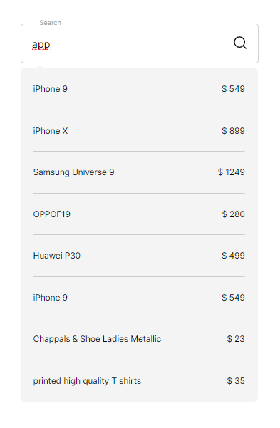

# Search Bar Project

## Screenshots



## Description

This project is a simple yet powerful search bar implemented using pure HTML, SCSS, and Vanilla JavaScript. It fetches data from `https://dummyjson.com` and displays the results dynamically.

## Requirements

To run this project, you'll need a web browser that supports JavaScript.

## Installation and Usage

1. Clone the repository:

   ```bash
   git clone https://github.com/DamianPasterz/recruitment-task2.git
   ```

2. Navigate to the project directory:

   ```bash
   cd recruitment-task2
   ```

3. Open the `index.html` file in your web browser.
4. SCSS is compiled to CSS using Live Sass Compiler v6.1.2. Ensure you have this extension installed in your Visual Studio Code editor, or any other compatible editor, and that it is configured to compile SCSS files to CSS.

## Directory Structure

      ├── index.html
      └── src
         └── api.js
      └── modules
         ├── debounce.js
         ├── api.js
         └── search.js
      └── styles
         ├── style.scss
         ├── style.css
         ├── _result.scss
         ├── _layout.scss
         └── _search.scss


- `index.html`: Main HTML file containing the search bar structure.
- `src/modules/api.js`: JavaScript module responsible for fetching data from the API.
- `src/styles/style.css`: CSS file generated from SCSS, containing styles for the search bar and its components.
- `src/styles/style.scss`: SCSS file containing styles for the search bar and its components.
- `src/styles/_result.scss`:SCSS file containing specific styles for the resault container
- `src/styles/_search.scss`: SCSS file containing specific styles for the search bar component.
- `src/styles/_layout.scss`: SCSS file containing layout styles for the search bar component.

## Technologies Used

- HTML
- CSS (SCSS)
- JavaScript (Vanilla)

## Author

This project was created by Damian Pasterz. Contact: damian.pasterz@gmail.com.

## License

This project is licensed under the MIT License. For more information, see the LICENSE.md file.
